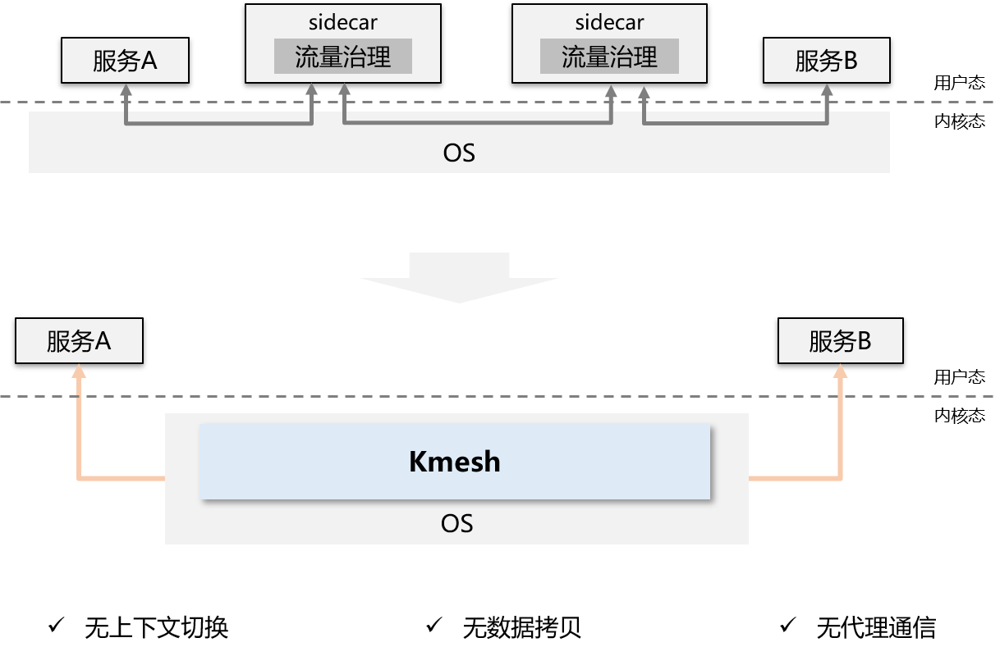
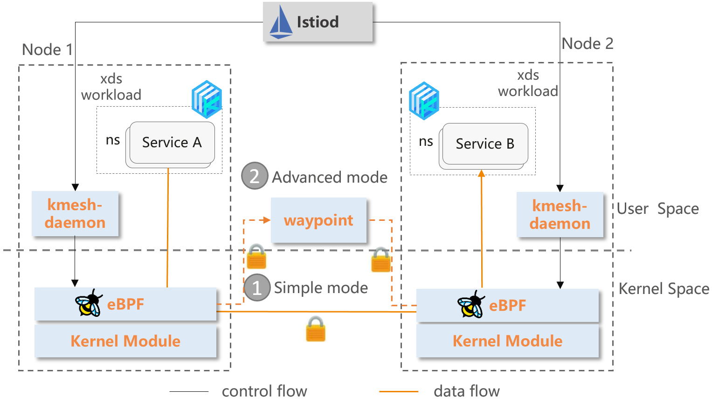

## 介绍

Kmesh是一种基于可编程内核实现的高性能服务网格数据面；提供服务网格场景下高性能的服务通信基础设施。

## 为什么需要Kmesh

### 服务网格数据面的挑战

Istio为代表的服务网格已逐步流行，成为云上基础设施的重要组成；但当前的服务网格仍面临一定的挑战：

- **代理层引入额外时延开销**：服务访问单跳增加[2~3ms](https://istio.io/latest/docs/ops/deployment/performance-and-scalability/#data-plane-performance)，无法满足时延敏感应用的SLA诉求；虽然社区基于该问题演进出了多种数据面方案，但仍无法完全消减代理引入的开销；
- **资源占用大**：代理占用额外CPU/MEM开销，业务容器部署密度下降；

### Kmesh：内核级原生流量治理

Kmesh创新性的提出将流量治理下沉OS，在数据路径上无需经过代理层，构建应用透明的sidecarless服务网格。



### Kmesh关键特性

**平滑兼容**

- 应用透明的流量治理
- 自动对接Istiod

**高性能**

- 网格转发时延**60%↓**
- 服务启动性能**40%↑**

**低开销**

- 网格底座开销**70%↓**

**安全隔离**

- ebpf虚机安全
- cgroup级编排隔离

**全栈可视化**

- 端到端指标采集*
- 主流观测平台对接*

**开放生态**

- 支持XDS协议标准

注：* 规划中；

## 快速开始

- 前提条件

  - Kmesh当前是对接Istio控制面，启动Kmesh前，需要提前安装好Istio的控制面软件；具体安装步骤参考：https://istio.io/latest/docs/setup/getting-started/#install
  - 完整的Kmesh能力依赖对OS的增强，需确认执行环境是否在Kmesh支持的[OS列表](docs/kmesh_support-zh.md)中，对于其他OS环境需要参考[Kmesh编译构建](docs/kmesh_compile-zh.md)；也可以使用[兼容模式的kmesh镜像](build/docker/README.md#兼容模式镜像)在其他OS环境中进行尝试，关于kmesh各种镜像的说明请参考[详细文档](build/docker/README.md)。
  - 不同的环境中集群config文件位置有所区别，需要用户在yaml文件中指定当前集群中config文件位置并映射至镜像

- Docker镜像：

  Kmesh实现通过内核增强将完整的流量治理能力下沉至OS。当发布镜像时，镜像适用的OS的范围是必须考虑的。因此，我们考虑发布两种类型的镜像：

  - 支持内核增强的OS版本：

    当前[openEuler 23.03](https://repo.openeuler.org/openEuler-23.03/)原生支持Kmesh所需的内核增强特性。Kmesh发布的镜像可以直接在该OS上安装运行。对于详细的支持内核增强的OS版本列表，请参见[链接](https://github.com/kmesh-net/kmesh/blob/main/docs/kmesh_support.md)。
  
  - 不支持内核增强的OS版本：

    为了兼容不同的OS版本，Kmesh提供在线编译并运行的镜像。在Kmesh被部署之后，它会基于宿主机的内核能力自动选择运行的Kmesh特性，从而满足一个镜像在不同OS环境运行的要求。

  ```
  # 用于openEuler 23.03 OS的Kmesh x86镜像
  docker pull ghcr.io/kmesh-net/kmesh:v0.1.0

  # x86镜像用于Kmesh的在线编译以及执行，支持的OS版本为5.10及以上
  docker pull ghcr.io/kmesh-net/kmesh-x86:v0.1.0

  # The arm image for Kmesh online compilation and execution, supports OS kernel versions 5.10 and above.
  # arm镜像用于Kmesh的在线编译以及执行，支持的OS版本为5.10及以上
  docker pull ghcr.io/kmesh-net/kmesh-arm:v0.1.0
  ```
  
- 启动Kmesh容器

  ```sh
  # get kmesh.yaml：来自代码仓 build/docker/kmesh.yaml
  # 将镜像替换为适合你的OS的版本
  [root@ ~]# kubectl apply -f kmesh.yaml
  ```
  
  默认使用Kmesh功能，可通过调整yaml文件中的启动参数进行功能选择
  
  
- 查看kmesh服务启动状态

  ```sh
  [root@ ~]# kubectl get pods -A -owide | grep kmesh
  default        kmesh-deploy-j8q68                   1/1     Running   0          6h15m   192.168.11.6    node1   <none> 
  ```

- 查看kmesh服务运行状态

    ```sh
    [root@ ~]# kubectl logs -f kmesh-deploy-j8q68
    time="2023-07-25T09:28:37+08:00" level=info msg="options InitDaemonConfig successful" subsys=manager
    time="2023-07-25T09:28:38+08:00" level=info msg="bpf Start successful" subsys=manager
    time="2023-07-25T09:28:38+08:00" level=info msg="controller Start successful" subsys=manager
    time="2023-07-25T09:28:38+08:00" level=info msg="command StartServer successful" subsys=manager
    ```

  更多Kmesh编译构建方式，请参考[Kmesh编译构建](docs/kmesh_compile-zh.md)

## Kmesh性能

基于fortio对比测试了Kmesh和envoy的数据面执行性能；测试结果如下：


完整的性能测试请参考[Kmesh性能测试](test/performance/README-zh.md)；

## 软件架构



Kmesh的主要部件包括：

- kmesh-controller：

  kmesh管理程序，负责Kmesh生命周期管理、XDS协议对接、观测运维等功能；

- kmesh-api：

  kmesh对外提供的api接口层，主要包括：xds转换后的编排API、观测运维通道等；

- kmesh-runtime：

  kernel中实现的支持L3~L7流量编排的运行时；

- kmesh-orchestration：

  基于ebpf实现L3~L7流量编排，如路由、灰度、负载均衡等；

- kmesh-probe：

  观测运维探针，提供端到端观测能力；

## 特性说明

- Kmesh命令列表

  [Kmesh命令列表](docs/kmesh_commands-zh.md)

- demo演示

  [Kmesh demo演示](docs/kmesh_demo-zh.md)

## Kmesh能力地图

| 特性域       | 特性                     |          2023.H1           |          2023.H2           |          2024.H1           |          2024.H2           |
| ------------ | ------------------------ | :------------------------: | :------------------------: | :------------------------: | :------------------------: |
| 流量管理     | sidecarless网格数据面    | √ |                            |                            |                            |
|              | sockmap加速              |                            | √ |                            |                            |
|              | 基于ebpf的可编程治理     | √ |                            |                            |                            |
|              | http1.1协议              | √ |                            |                            |                            |
|              | http2协议                |                            |                            |                            | √ |
|              | grpc协议                 |                            |                            |                            | √ |
|              | quic协议                 |                            |                            |                            | √ |
|              | tcp协议                  |                            | √ |                            |                            |
|              | 重试                     |                            |                            | √ |                            |
|              | 路由                     | √ |                            |                            |                            |
|              | 负载均衡                 | √ |                            |                            |                            |
|              | 故障注入                 |                            |                            | √ |                            |
|              | 灰度发布                 |                            | √ |                            |                            |
|              | 熔断                     |                            |                            | √ |                            |
|              | 限流                     |                            |                            | √ |                            |
| 服务安全     | mTLS                     |                            |                            |                            | √ |
|              | L7授权                   |                            |                            |                            | √ |
|              | 治理pod级隔离            | √ |                            |                            |                            |
| 流量监控     | 基础观测（治理指标监控） |                            | √ |                            |                            |
|              | E2E可观测                |                            |                            |                            | √ |
| 可编程       | 插件式扩展能力           |                            |                            |                            | √ |
| 生态协作     | 数据面协同（Envoy等）    |                            | √ |                            |                            |
| 运行环境支持 | 容器                     | √ |                            |                            |                            |

## 联系人

如果您有任何问题，请随时通过以下方式联系我们：

- [meeting notes](https://docs.google.com/document/d/1fFqolwWMVMk92yXPHvWGrMgsrb8Xru_v4Cve5ummjbk)
- [mailing list](https://groups.google.com/forum/#!forum/kmesh)
- [slack](https://join.slack.com/t/kmesh/shared_invite/zt-23mte0eau-s3MoQNYPzsgvUwwXkOmIIA)
- [twitter](https://twitter.com/kmesh_net)

## 贡献

如果您有兴趣成为贡献者，并希望参与开发Kmesh代码，请参见[贡献](CONTRIBUTING.md)了解有关提交补丁程序和贡献工作流的详细信息。

## 许可证

Kmesh在Apache 2.0许可证下。有关详细信息，请参见[LICENSE](LICENSE) 文件。

Kmesh文档位于[CC-BY-4.0 license](https://creativecommons.org/licenses/by/4.0/legalcode)下。

## 致谢

此项目最初在[openEuler社区](https://gitee.com/openeuler/Kmesh)孵化，感谢openEuler社区在早期推动该项目的帮助。
