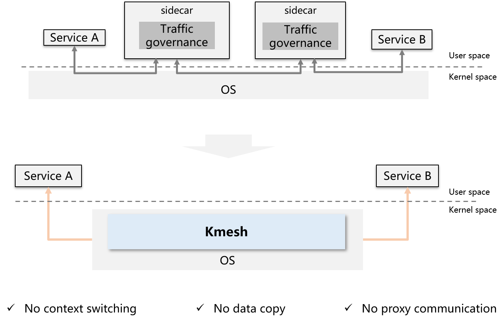
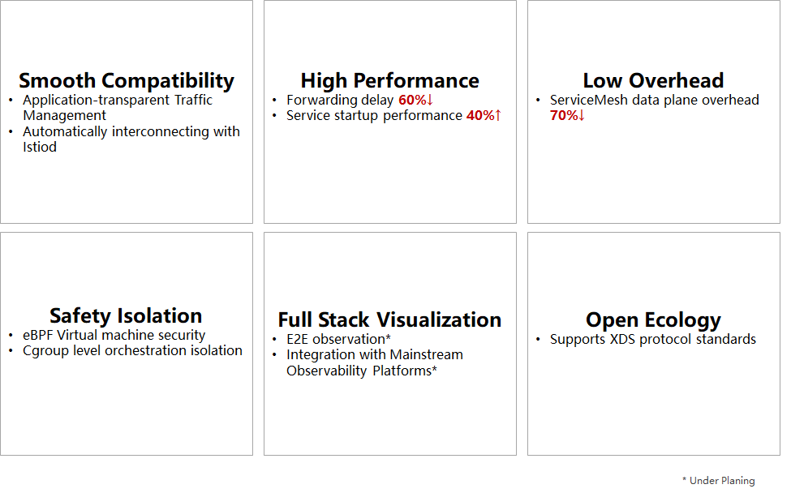

### Introduction

Kmesh is a high-performance service mesh data plane software based on programmable kernel. Provides high-performance service communication infrastructure in service mesh scenarios.

### Why Kmesh

#### Challenges of the Service Mesh Data Plane

The service mesh software represented by Istio has gradually become popular and has become an important component of cloud infrastructure. However, the current service mesh still face some challenges:

- **Extra latency overhead at the proxy layer**: Single hop service access increases by [2~3ms](https://istio.io/latest/docs/ops/deployment/performance-and-scalability/#data-plane-performance), which cannot meet the SLA requirements of latency-sensitive applications. Although the community has come up with a variety of data plane solutions to this problem, the overhead introduced by agents cannot be completely reduced.
- **High resources occupation**: The agent occupies extra CPU/MEM overhead, and the deployment density of service container decreases.

#### Kmesh：Kernel-native traffic governance

Kmesh innovatively proposes to move traffic governance to the OS, and build a transparent sidecarless service mesh without passing through the proxy layer on the data path.



#### Key features of Kmesh



### Quick Start

- prerequisite

  Currently, Kmesh connects to the Istio control plane. Before starting Kmesh, install the Istio control plane software. For details, see https://istio.io/latest/docs/setup/getting-started/#install.

- Kmesh container image prepare

  ```sh
  # add an image registry: hub.oepkgs.net
  [root@ ~]# cat /etc/docker/daemon.json
      {
              "insecure-registries": [
                      ...,
                      "hub.oepkgs.net"
              ]
      }
  
  # docker pull
  [root@ ~]# docker pull hub.oepkgs.net/oncn/kmesh:latest
  ```

- Start Kmesh

  ```sh
  # get kmesh.yaml from build/docker/kmesh.yaml
  [root@ ~]# kubectl apply -f kmesh.yaml
  ```
  
  By default, the Kmesh base function is used, other function can be selected by adjusting the startup parameters in the yaml file.
  
- Check kmesh service status

  ```sh
  [root@ ~]# kubectl get pods -A -owide | grep kmesh
    default        kmesh-deploy-j8q68                   1/1     Running   0          6h15m   192.168.11.6    node1   <none> 
  ```

- View the running status of kmesh service

  ```sh
  [root@ ~]# kubectl logs -f kmesh-deploy-j8q68
    time="2023-07-25T09:28:37+08:00" level=info msg="options InitDaemonConfig successful" subsys=manager
    time="2023-07-25T09:28:38+08:00" level=info msg="bpf Start successful" subsys=manager
    time="2023-07-25T09:28:38+08:00" level=info msg="controller Start successful" subsys=manager
    time="2023-07-25T09:28:38+08:00" level=info msg="command StartServer successful" subsys=manager
  ```

  More compilation methods of Kmesh, See: [Kmesh Compilation and Construction](docs/kmesh_compile.md)

### Kmesh Performance

Based on Fortio, the data plane execution performance of Kmesh and Envoy was compared and tested. The test results are as follows:


For a complete performance test, please refer to [Kmesh Performance Test](test/performance/README.md).

### Software Architecture


The main components of Kmesh include:

- kmesh-controller：

  Kmesh management program, responsible for Kmesh lifecycle management, XDS protocol docking, observation and DevOps, and other functions.

- kmesh-api：

  The API interface layer provided by Kmesh mainly includes: orchestration API after xds conversion, observation and DevOps channels, etc.

- kmesh-runtime：

  The runtime implemented in the kernel that supports L3~L7 traffic orchestration.

- kmesh-orchestration：

  Implement L3-L7 traffic scheduling based on ebpf, such as routing, grayscale, load balance, etc.

- kmesh-probe：

  Observation and DevOps probes, providing end-to-end observation capabilities.

### Feature Description

- Development Guide

  [Kmesh Development Guide](docs/kmesh_development_guide.md)

- Command List

  [Kmesh Command List](docs/kmesh_commands.md)

- Test Framework

  [Kmesh Test Framework](test/README.md)
  
- Demo

  [Kmesh demo demonstration](docs/kmesh_demo.md)

### Kmesh Capability Map

| Feature Field       | Feature                     |          2023.H1           |          2023.H2           |          2024.H1           |          2024.H2           |
| ------------ | ------------------------ | :------------------------: | :------------------------: | :------------------------: | :------------------------: |
| Traffic management     | sidecarless mesh data  plane   |  |                            |                            |                            |
|              | sockmap accelerate       |                            |  |                            |                            |
|              | Programmable governance based on ebpf |  |                            |                            |                            |
|              | http1.1 protocol         |  |                            |                            |                            |
|              | http2 protocol           |                            |                            |                            |  |
|              | grpc protocol            |                            |                            |                            |  |
|              | quic protocol            |                            |                            |                            |  |
|              | tcp protocol             |                            |  |                            |                            |
|              | Retry                    |                            |                            |  |                            |
|              | Routing                  |  |                            |                            |                            |
|              | load balance             |  |                            |                            |                            |
|              | Fault injection |                            |                            |  |                            |
|              | Gray release   |                            |  |                            |                            |
|              | Circuit Breaker |                            |                            |  |                            |
|              | Rate Limits    |                            |                            |  |                            |
| Service security | SSL-based two-way authentication |                            |                            |                            |  |
|              | L7 authorization |                            |                            |                            |  |
|              | Cgroup-level isolation |  |                            |                            |                            |
| Traffic monitoring | Governance indicator monitoring |                            |  |                            |                            |
|              | End-to-End observability |                            |                            |                            |  |
| Programmable | Plug-in expansion capability |                            |                            |                            |  |
| Ecosystem collaboration | Data plane collaboration (Envoy etc.) |                            |  |                            |                            |
| Operating environment support | container                |  |                            |                            |                            |

