# 1、需求描述

随着越来越多的应用云原生化，云上应用的规模、应用SLA诉求等都对云基础设施提出了很高的要求；

基于k8s的云基础设施能够帮助应用实现敏捷的部署管理，但在应用流量编排方面有所欠缺；serviceMesh的出现很好的弥补了k8s流量编排的缺陷，与k8s互补，真正实现敏捷的云应用开发运维；

但随着对serviceMesh应用的逐步深入，当前基于sidecar的网格架构在数据面存在明显的性能缺陷，已成为业界共识的问题：

- 时延性能差

  以serviceMesh典型软件istio为例，网格化后，服务访问单跳时延增加2.65ms；无法满足时延敏感型应用诉求；

- 底噪开销大

  istio中，每个sidecar软件占用内存50M+，CPU默认独占2 core，对于大规模集群底噪开销太大，降低了业务容器的部署密度；

Kmesh基于可编程内核，将网格流量治理下沉OS，数据路径3跳->1跳，大幅提升网格数据面的时延性能，帮助业务快速创新；

## 1.1、受益人

| 角色         | 角色描述                                                     |
| :----------- | :----------------------------------------------------------- |
| 社区开发者   | 对项目感兴趣的并想参与到项目中，共同完善Kmesh能力；          |
| 系统运维人员 | 服务网格产品提供者将Kmesh作为网格数据面程序，对云应用提供轻载高性能的网格数据面能力； |

## 1.2、依赖组件

| 组件           | 组件描述                   | 可获得性                   |
| :------------- | :------------------------- | :------------------------- |
| 服务网格控制面 | 基于网格控制面下发编排规则 | 服务网格集群部署时必需部件 |

## 1.3、License

APL 2.0 / GPL

# 2、设计概述

## 2.1、分析思路

- 网格数据面耗时分布

  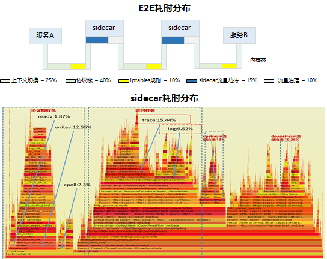

  网格耗时分布可以看出：sidecar架构引入大量时延开销，流量编排只占网格开销的10%，大部分开销在数据拷贝、多出两次的建链通信、上下文切换调度等。

- Kmesh设计思路

  基于可编程内核，将流量治理下沉OS，实现流量路径多跳变一跳。

  

  Kmesh方案与主流网格数据面方案的服务访问流程对比：

  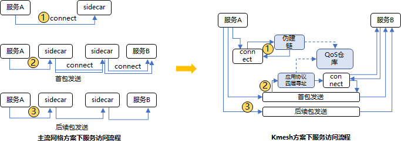

- Kmesh功能部件划分

  Kmesh是基于可编程内核实现的高性能网格数据面；功能部件看分为以下几部分：

  - kmesh-controller：

    kmesh管理程序，负责Kmesh生命周期管理、XDS协议对接、观测运维等功能；

  - kmesh-api：

    kmesh对外提供的api接口层，主要包括：xds转换后的编排API、观测运维通道等；

  - kmesh-runtime：

    kernel中实现的支持L3~L7流量编排的运行时；

  - kmesh-orchestration：

    基于ebpf实现L3~L7流量编排，如路由、灰度、负载均衡等；

  - kmesh-probe（暂未支持）：

    观测运维探针，提供端到端观测能力；

## 2.2、设计原则

除了基本的DFX设计准则外，在程序设计时考虑以下几个方面：

1. 部件内模块化设计

   如kmesh-controller按不同功能模块组织代码结构，提供模块间访问接口；kmesh-orchestration中的编排能力支持灵活组合；

2. 部件间标准接口，考虑生态对接

   北向Kmesh支持XDS协议对接，OS层面提供kmesh api接口；

3. 通用性原则

   如内核代码修改尽量避免侵入修改，必要修改考虑通用化和上游推送；

# 3、需求分析

## 3.1、USE-CASE图

#### 3.1.1 Kmesh部署

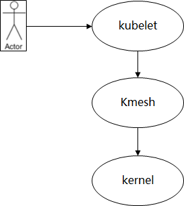

#### 3.1.2 Kmesh治理规则下发


## 3.2、逻辑视图

Kmesh总体逻辑视图：

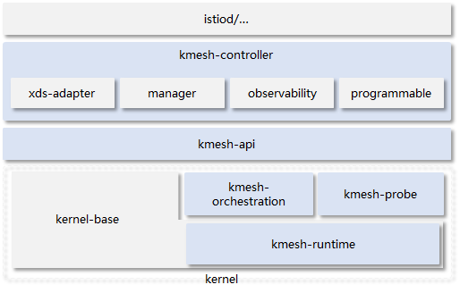

## 3.3、开发视图

### 3.3.1 Kmesh

```shell
[root@dev Kmesh]# tree -L 2
.
├── api					# Kmesh对外提供的proto模型层，兼容xds协议
│   ├── admin
│   ├── cluster
│   ├── core
│   ├── endpoint
│   ├── filter
│   ├── listener
│   ├── Makefile
│   ├── route
│   └── v2-c						# proto
├── bpf					# ebpf相关特性
│   ├── deserialization_to_bpf_map	# kmesh规则配置api
│   ├── include
│   └── kmesh						# kmesh流量编排模块，通过ebpf实现随流编排能力
├── build				# 构建相关
│   ├── kmesh.service				# service配置文件
│   ├── kmesh-start-pre.sh			# service启动前处理脚本
│   ├── kmesh-stop-post.sh			# service停止后处理脚本
│   └── kmesh-docker_file			# kmesh docker file
│   └── kmesh-daemonset.yaml		# kmesh daemonset yaml
├── build.sh			# 编译脚本
├── config				# Kmesh启动配置文件
│   └── kmesh.json
├── daemon				# kmesh-daemon主模块
│   ├── main.go
│   └── manager
├── depends				# kmesh外部编译依赖文件，主要归档了新增bpf-helper的部分
│   └── include
├── docs				# 文档相关
├── examples			# 
│   ├── api-v2-config
│   ├── envoy-config-bootstrap
│   ├── kernel
│   └── kubernetes-openeuler-istio
├── go.mod
├── go.sum
├── kernel				# kmesh-runtime相关模块
│   ├── ko
│   ├── ko_src			# kmesh.ko
│   └── patches			# 内核增强特性：延迟建链、bpf hook、bpf-helper等
├── kmesh.spec
├── LICENSE
├── Makefile
├── mk
│   ├── api-v2-c.pc
│   ├── bpf.pc
│   ├── bpf.print.mk
│   ├── bpf.vars.mk
│   └── pkg-config.sh
├── pkg					# kmesh-daemon子模块
│   ├── bpf							# bpf-manager模块，负责bpf程序加卸载等
│   ├── cache						# 控制面proto配置解析模块
│   ├── controller					# 控制面对接模块
│   ├── logger						# 日志模块
│   ├── nets						# 网络模块，建联等基础接口
│   └── options						# 参数解析模块
├── README.en.md
├── README.md
├── release				# 发布件归档
│   ├── kernel						# 包含Kmesh增强特性的kernel包
│   └── kmesh						# kmesh.rpm、容器镜像等
├── test				# 测试模块
│   ├── performance					# 性能测试相关，归档了性能测试方法/工具
│   ├── README.md
│   ├── runtest.sh		# test入口
│   ├── testcases		# 测试例集合
│   └── testframe		# 测试框架mugen
└── vendor				# go依赖库
    ├── github.com
    ├── golang.org
    ├── google.golang.org
    ├── gopkg.in
    ├── modules.txt
    └── sigs.k8s.io

52 directories, 23 files
[root@dev Kmesh]#
```

## 3.4、部署视图

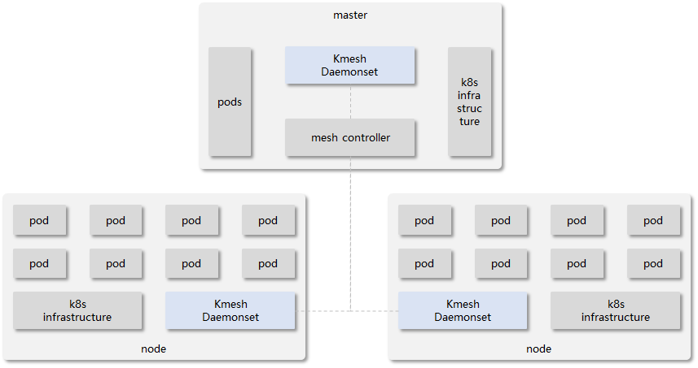

- Kmesh以Daemonset方式在集群中部署；

## 3.5、DFX分析

### 3.5.1、规格

- Kmesh

  | 规格名称  | 规格指标 |
  | --------- | -------- |
  | 内存占用  | < 200M   |
  | CPU使用率 | 1 core   |


### 3.5.2、系统可靠性设计

基于ebpf编写数据面编排规则，继承ebpf verify能力；

### 3.5.3、安全性设计

Kmesh安全威胁分析：

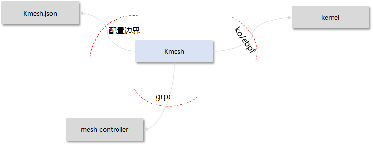

- Kmesh涉及ko/ebpf程序加载，依赖root执行权限；
- kmesh.json主要涉及服务初始编排规则及编排控制面ip信息；实际部署时，控制面地址会通过`ns:serviceName`从K8S集群中动态获取，控制面规则会实时刷新；
- 与mesh控制面之间通过grpc订阅

### 3.5.4、兼容性设计

不涉及；

### 3.5.5、可服务性设计

Kmesh支持两种启动部署模式：

- Daemonset启动

  集群部署时，以Daemonset模式部署，若Kmesh异常可由K8S保证Kmesh的再次拉起；

- Service启动

  单机部署时，支持service模式启动，若Kmesh异常可由systemd保证Kmesh的再次拉起；


### 3.5.6、可测试性设计

Kmesh基于mugen实现了自己的测试框架，以看护Kmesh基本功能稳定；详见[Kmesh测试框架](../test/README.md)。

## 3.6、特性清单

Kmesh主要功能模块分为：

- kmesh-runtime：

  kernel中实现的支持L3~L7流量编排的运行时；

- kmesh-orchestration：

  基于ebpf实现L3~L7流量编排，如路由、灰度、负载均衡等；

- kmesh-controller：

  kmesh管理程序，负责Kmesh生命周期管理、XDS协议对接、观测运维等功能；

### 3.6.1 kmesh-runtime

- 现状
  - 内核协议栈中只支持基于iptables的L4以下的流量编排规则
  - 随着iptables规则数随集群规模变大后存在读写访问的性能问题；
- kmesh-runtime
  - 基于伪建链、延迟建链等技术，实现L3~L7的编排底座；
  - 基于ebpf，在内核协议栈中构筑可编程的全栈流量编排运行时；
  - 基于ebpf的轻量级观测框架，实现E2E运维；

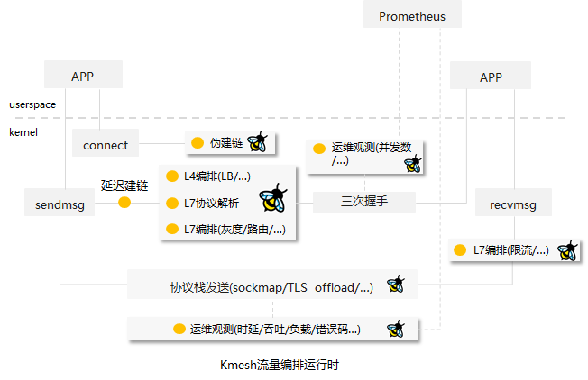

具体实现上：

- 内核特性增强

  - 支持proto ops的重载

    pinet_register_protosw支持INET_PROTOSW_PERMANENT_OVERRIDE flag；

  - struct inet_sock支持延迟建链标记

  - 新增bpf_helper：字符串操作、内存操作、消息头解析等helper；

- kmesh.ko -- 实现inet proto ops重载

  - 重载tcp proto ops回调
  - tcp connect流程支持延迟建链功能
  - tcp send阶段支持延迟建链处理

  - 支持L7协议解析

  proto ops重载逻辑：

  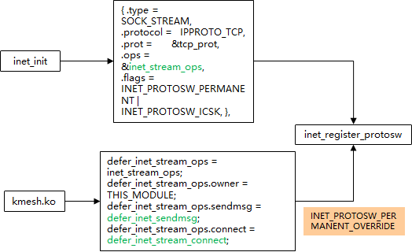

  延迟建链逻辑：

  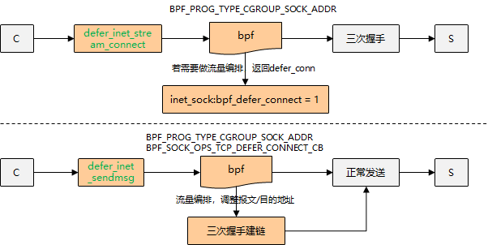

### 3.6.2 kmesh-orchestration

基于ebpf实现L3~L7流量编排，如路由、灰度、负载均衡等；


#### 3.6.2.1 L4流量编排

- 模型设计：tcp_proxy结构下新增oneof cluster_specifier字段，支持订阅普通cluster或带权重的WeightedCluster信息

  ```protobuf
  message TcpProxy {
    // cluster based on weights.
    message WeightedCluster {
      message ClusterWeight {
        // cluster name
        string name = 1;
  
        // the choice of an cluster is determined by its weight
        uint32 weight = 2;
      }
  
      // Specifies one or more upstream clusters.
      repeated ClusterWeight clusters = 1;
    }
  
    oneof cluster_specifier {
      //cluster name to connect to.
      string cluster = 2;
  
      // Multiple upstream clusters can be specified for a given route. The
      // request is routed to one of the upstream clusters based on weights
      // assigned to each cluster.
      WeightedCluster weighted_clusters = 10;
    }
  
  }
  ```

  

- 功能设计：支持tcp_proxy 类型的filter（流量过滤器），设计如图中L4:tcp_prxoy分支处理流程

  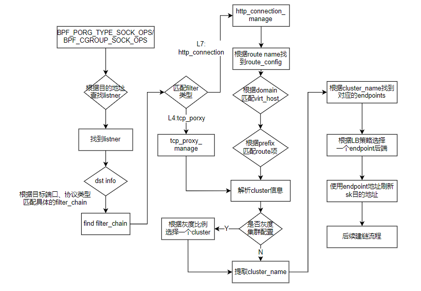

  - 数据面进行消息匹配时，在filter_manager流程匹配当前对应的filter类型，如果是tcp_proxy filter，无需走L7路由治理逻辑，直接走L4治理逻辑，在tcp_proxy_manager中解析该filter下的cluster信息，此处分两种情况：

    1）集群未配置WeightedCluster，则解析cluster_name，并ebpf尾调用到cluster_manager流程去做后续的endpoints负载均衡逻辑；

    2）集群配置WeightedCluster，即带有权重的一组cluster配置，则根据权重比例获取对应的cluster_name，并ebpf尾调用到cluster_manager流程去做后续的endpoints负载均衡。

    

- 能力验证：

  - 在集群中部署tcp类型的tcp-echo-service，指定v1、V2两个版本后端，启动kmesh数据面

  - 使用测试工具，访问tcp-echo-service，服务能够正常访问，v1、v2两个后端轮旬访问，功能正常

  - 在集群中新增VirtualService配置，配置灰度权重比例，访问tcp-echo-service，预期按照灰度比例访问V1、v2两个后端，功能正常

    注：可使用社区提供的测试demo覆盖测试 (https://istio.io/latest/zh/docs/tasks/traffic-management/tcp-traffic-shifting/) 

    

### 3.6.3 kmesh-controller

kmesh管理程序，负责Kmesh生命周期管理、XDS协议对接、观测运维等功能；

- 定义编排模型

  定义L3~L7的编排模型，通过proto表达，支持与XDS协议兼容；

  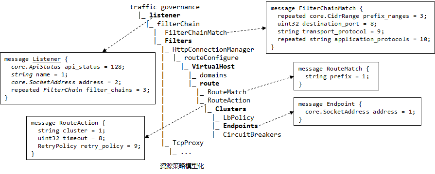

- 编排规则转换成bpf map数据

  Kmesh数据面是基于ebpf prog驱动的，控制面下发的编排规则需要转换成bpf的map数据存储；

  控制面规则本身是一颗树型结构，而bpf map可以看成是一张张平铺的表；如何通过平铺的二维表来表达树型规则是面临的难点；

  引入bpf map-in-map特性，通过outer-map组织不同inner-map，实现树型数据实例的表达；

  - proto模型--> proto-c结构

    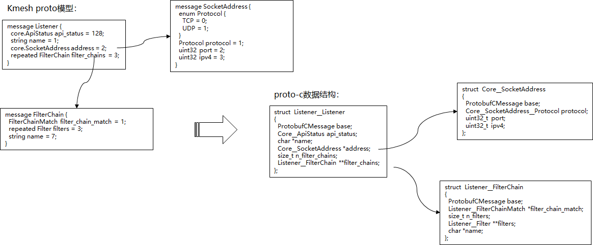

  - proto-c数据 --> bpf map

    **基本思路：**

    基于pb数据，对于每个数据结构存储一条inner_map记录

    数据结构成员分为几类：

    1、字符串型：成员val位置替换成outer_map idx，outer_map对应记录存储实际存放string值的inner_map fd

    2、数组型：成员val位置替换成outer_map idx， outer_map对应记录存储实际存放数组成员值的inner_map fd，注意这里的数组成员值又分两类：a）普通类型成员，直接存储实际的值；b）string/数据结构，存储每个成员对应的outer_map idx，依次类推；

    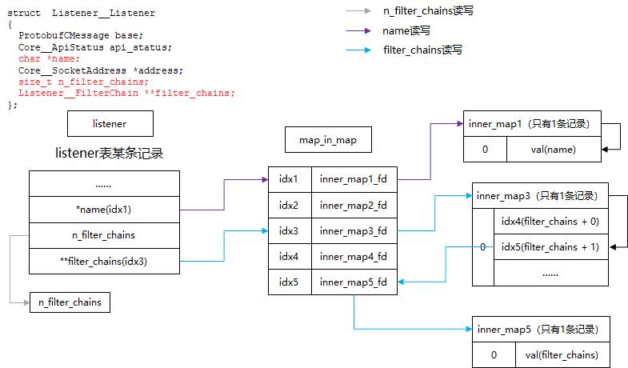

    1. n_filter_chains访问方式：

       listener->n_filter_chains，因为是基础数据类型，可直接访问map val部分

    2. name访问方式：

       根据listener->name作为idx在map_in_map中找到真正存储name的内部mapFd

       查找返回内部map对应的第一条记录的val，就是name

    3. 某个具体filter_chains访问方式：

       根据listener->filter_chains作为idx查找在map_in_map中找到这个二维指针数组对应的内部mapFd

       内部map中只有1条记录，val是一段buff，依次存储每个filter_chains在map_in_map中的idx

       访问第二条filter_chains时，根据idx5在map_in_map中找到真正存储filter_chains结构的内部mapFd，再查找返回内部map对应的第一条记录的val，就是filter_chains

### 3.6.3 需求列表

| SR                                             | AR                                                           | 详细描述                                                     | 落地版本 |
| ---------------------------------------------- | ------------------------------------------------------------ | ------------------------------------------------------------ | -------- |
| 服务间调用通信时延相比业界方案（istio）降低3倍 | 服务间调用通信时延相比业界方案（istio）降低3倍               | 服务间调用通信时延相比业界方案（istio）降低3倍               | 23.03    |
| 支持L4基本流量编排能力                         | 支持tcp_proxy 类型的filter（流量过滤器），支持基本通路和灰度流量配置 | 支持tcp_proxy 类型的filter（流量过滤器），支持基本通路和灰度流量配置 | 23.09    |

## 3.7、接口清单

### 3.7.1、外部接口清单

- Kmesh proto

  定义了Kmesh当前支持的编排模型范围；

  - 模型以protobuf格式定义
  - 支持兼容XDS协议

  具体接口定义参见[Kmesh proto定义](../api);

- kmesh.json

  配置Kmesh启动需要的全局配置信息 ，包括：serviceMesh控制面程序ip/port配置等；用户根据实际环境配置；

  ```json
  [root@dev ~]# vim /etc/kmesh/kmesh.json
  {
          "name": "xds-grpc",		# 1 找到该项配置
          "type" : "STATIC",
          "connect_timeout": "1s",
          "lb_policy": "ROUND_ROBIN",
          "load_assignment": {
            "cluster_name": "xds-grpc",
            "endpoints": [{
              "lb_endpoints": [{
                "endpoint": {
                  "address":{
                    "socket_address": {
                      "protocol": "TCP",
                      "address": "192.168.123.123", # 2 设置控制面ip(如istiod ip)
                      "port_value": 15010
                    }
                  }
                }
              }]
            }]
          },
  ```

### 3.7.2、内部模块间接口清单

- 序列化API

  kmesh-controller与网格控制面对接，获取到编排规则后，调用序列化API接口将编排规则转换成bpf map数据格式下发到Kmesh内核中；

  ```c
  int deserial_update_elem(void *key, void *value);
  void* deserial_lookup_elem(void *key, const void *msg_desciptor);
  void deserial_free_elem(void *value);
  int deserial_delete_elem(void *key, const void *msg_desciptor);
  ```

  - key

    当前顶层类的key数据地址；当前定义的顶层类有`listener`、`cluster`、`route`；

  - value

    protobuf数据转换成c内存结构的数据地址；

  - msg_desciptor

    顶层类对应的protobuf模型元数据；

# 4、修改日志

| 版本 | 发布说明          |
| :--- | :---------------- |
| 0.1  | Kmesh设计文档初稿 |


# 5、参考目录

NA
