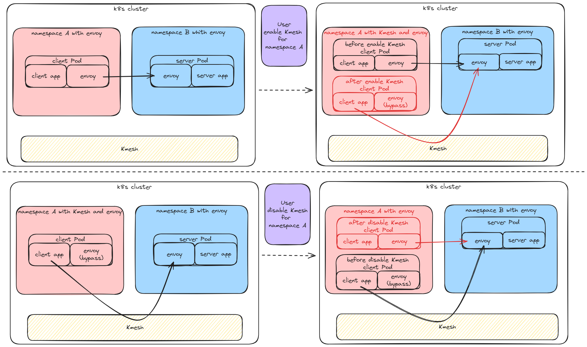
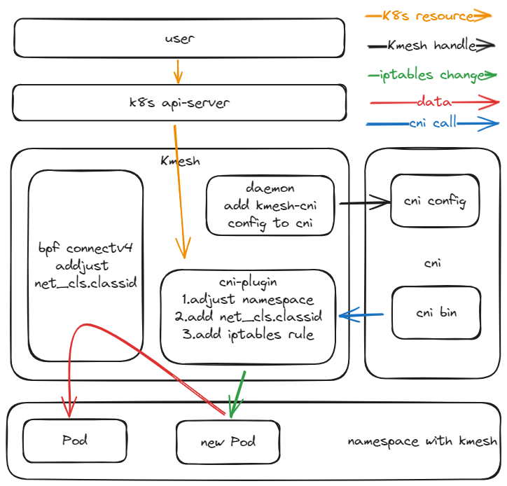

# 多网格数据面协同设计文档

## 背景

传统的serviceMesh以namespace为粒度来使能serviceMesh功能。在不同的namespace中，可能会使用不同的serviceMesh软件。Kmesh作为serviceMesh的数据面软件之一，在使用过程中，可能与不同的serviceMesh数据面协同工作，本文档主要对Kmesh作为数据面软件与其他serviceMesh数据面软件进行协同工作的场景进行描述。

## 支持的使用场景

Kmesh作为client端使用：

1. 使用Kmesh纳管pod与普通pod进行通讯
2. 双端都使用Kmesh进行通讯
3. 使用Kmesh纳管与sidecar（envoy）网格数据面中的pod进行通讯

Kmesh作为Server端使用：

1. Kmesh仅在Server端有envoy注入标签时，通过iptables来短接envoy

当前存在问题的场景：

Kmesh当前不支持在Server端短接sidecar（envoy）并与使用sidecar（envoy）作为Client端的Pod进行协同通信，原因是因为Client上有sidecar（envoy）发送时，识别到Server端也有sidecar（envoy）时，会使用mTLS进行加密通讯，Kmesh当前无法进行解密，计划在后续版本中支持此特性。

## 规格约束

1. 使用Kmesh纳管Pod时基于namespace粒度
2. Kmesh纳管namespace生效后，只影响新启动的Pod，对存量的Pod没有影响，Kmesh结束纳管同理。

## 场景价值

在同一个集群范围内，可能会部署多个网格数据面，Kmesh需要与无网格、其他类型网格代理的namespace中的Pod进行通讯，需要保证其中的Pod之间通信结果正常。

## 用户场景一：Kmesh代理pod与普通pod进行通讯分析：

场景描述

- 纳管Pod上没有envoy
	- 用户指定namespace使用Kmesh作为数据面
		- 新启动Pod通过Kmesh编排寻址访问server端
		- 存量Pod不受影响，仍使用k8s原生svc寻址访问server端
	- 用户指定namespace不再使用Kmesh作为数据面
		- 新启动Pod通过k8s原生svc进行访问server端
		- 存量Pod不受影响，Kmesh代理的容器，仍通过Kmesh编排后访问server端

- 纳管Pod上有envoy
	- 用户指定namespace使用Kmesh作为数据面，此namespace、访问的svc中对应的pod中都安装了envoy
		- 新启动的Pod通过Kmesh编排寻址并短接envoy访问server端
		- 存量Pod不受影响，通过envoy进行编排访问server端
	- 用户指定namespace不再使用Kmesh作为数据面，此namespace、访问的svc中对应的pod中都安装了envoy
		- 新启动Pod通过envoy编排后访问server端
		- 存量Pod不受影响，Kmesh纳管的容器，仍通过Kmesh编排寻址并短接envoy来访问server端

## 用户场景二：Kmesh纳管pod与Kmesh数据面中的pod进行通讯分析：

场景描述
当前Kmesh作为服务端代理不对连接至服务连接做任何操作，故连接场景与用户场景一一致

- 纳管Pod上没有envoy
	- 用户指定namespace使用Kmesh作为数据面，此namespace中未安装envoy，访问的svc中Node安装了Kmesh
		- 新启动的Pod通过Kmesh编排寻址访问server端，server侧Kmesh无处理，直通server服务
		- 存量Pod不受影响，通过k8s原生svc进行访问server端，server侧Kmesh无处理，直通server服务
	- 用户指定namespace不再使用Kmesh作为数据面，此namespace中未安装envoy，访问的svc中Node安装了Kmesh
		- 新启动Pod通过k8s原生svc进行访问server端，server侧Kmesh无处理，直通server服务
		- 存量Pod不受影响，Kmesh纳管的容器，仍通过Kmesh编排后访问server端，server侧Kmesh无处理，直通server服务

- 纳管Pod上有envoy
	- 用户指定namespace使用Kmesh作为数据面，此namespace、访问的svc中Node安装了Kmesh
		- 新启动的Pod通过Kmesh编排寻址并短接envoy访问server端，server侧Kmesh无处理，直通server服务
		- 存量Pod不受影响，通过envoy进行编排访问server端，server侧Kmesh无处理，直通server服务
	- 用户指定namespace不再使用Kmesh作为数据面，此namespace、访问的svc中Node安装了Kmesh
		- 新启动Pod通过envoy编排后访问server端，server侧Kmesh无处理，直通server服务
		- 存量Pod不受影响，Kmesh纳管的容器，仍通过Kmesh编排寻址并短接envoy来访问server端，server侧Kmesh无处理，直通server服务

## 用户场景三：Kmesh纳管pod与sidecar(envoy)数据面中的pod进行通讯分析：

场景描述

- 纳管Pod上没有envoy
	- 用户指定namespace使用Kmesh作为数据面，此namespace中未安装envoy，访问的svc中pod安装了envoy
		- 新启动的Pod通过Kmesh编排寻址访问server端，server由envoy进行接收纳管
		- 存量Pod不受影响，通过k8s原生svc进行访问server端，server由envoy进行接收纳管
	- 用户指定namespace不再使用Kmesh作为数据面，此namespace中未安装envoy，访问的svc中pod安装了envoy
		- 新启动Pod通过k8s原生svc进行访问server端，server由envoy进行接收纳管
		- 存量Pod不受影响，Kmesh纳管的容器，仍通过Kmesh编排后访问server端，server由envoy进行接收纳管

- 纳管Pod上有envoy
	- 用户指定namespace使用Kmesh作为数据面，此namespace、访问的svc中对应的pod中都安装了envoy
		- 新启动的Pod通过Kmesh编排寻址并短接envoy访问server端，server由envoy进行接收纳管
		- 存量Pod不受影响，通过envoy进行编排访问server端，server由envoy进行接收纳管
	- 用户指定namespace不再使用Kmesh作为数据面，此namespace、访问的svc中对应的pod中都安装了envoy
		- 新启动Pod通过envoy编排后访问server端，server由envoy进行接收纳管
		- 存量Pod不受影响，Kmesh纳管的容器，仍通过Kmesh编排寻址并短接envoy来访问server端，server由envoy进行接收纳管

## usecase
### 使用接口设计

	# 对指定的namespace来启用Kmesh
	kubectl label namespace xxx istio.io/dataplane-mode=Kmesh
	# 对指定的namespace来关闭Kmesh
	kubectl label namespace xxx istio.io/dataplane-mode-

## 功能实现原理：
### 组件设计
要实现上述功能，从用户指定对特定namespace启用Kmesh到整体功能生效，涉及的组件如下图

Kmesh中需要进行修改的有如下组件：

#### daemon

daemon需要对cni插件进行管理，将Kmesh启动、cni pod重启时，将cni插件调用信息写入到/etc/cni/net.d的对应conflist中。calico的conflist的格式如下：

	{
		"name": "k8s-pod-network",
		"cniVersion": "0.3.1",
		"plugins": [
			{
				"type": "calico",
				"log_level": "info",
				...
			},
			{
				"type": "portmap",
				...
			},
			...
			// 新增kmesh的cni-plugin
			{
				"type": "Kmesh-cni",
			}
		]
	}

flannel的conflist格式如下：

	{
		"name": "cbr0",
		"cniVersion": "0.3.1",
		"plugins": [
			{
				"type": "flannel",
				...
			},
			...
			// 新增kmesh的cni-plugin
			{
				"type": "Kmesh-cni",
			}
		]
	}

daemon变更如下：

- 在kmesh使能时写入kemsh plugin配置到cni conflist中

	在kmesh-daemon启动时，自动将cni plugin配置`{"type":"kmesh-cni"}`写入到/etc/cni/net.d/目录中的配置文件(.conflist结尾)中去

- 在kmesh除能时从cni conflist中清理kmesh plugin配置 

	在kmesh-daemon退出时，自动将cni plugin配置`{"type":"kmesh-cni"}`从/etc/cni/net.d/目录中的配置文件(.conflist结尾)中删除

#### cni-plugin

cni用于在集群创建新的Pod时，判断该Pod是否属于打上Kmesh标签的namespace。

- 无`istio.io/dataplane-mode=Kmesh`，什么也不做
- 有`istio.io/dataplane-mode=Kmesh`，则在新创建的Pod的cgroup中修改net\_cls.classid为0x1000，**当前仅支持cgroupfs，不支持systemd**，cgroupfs的路径默认如下：/sys/fs/cgroup/net\_cls/kubepods/podxxxxxx/net_cls.classid
- 有`istio.io/dataplane-mode=Kmesh`且有`istio-injection=enabled`，则会进入到新建的Pod中加入以下iptables规则

收包路径上所有数据包短接envoy:

	iptables -t nat -I 1 PREROUTING -j RETURN

发包路径上所有数据包短接envoy：
	
	iptables -t nat -I 1 OUTPUT -j RETURN

#### ebpf cgroup/connect4

connect4，获取当前进程的classid，如果为0x1000，则Kmesh ebpf进行纳管，走后续的4层转发或ULP框架替换。

## 修改后默认行为对外变更

修改前：Kmesh使能后默认对环境上所有的Pod都生效，Pod都会通过Kmesh纳管访问svc。

修改后：Kmesh使能后默认不对环境上任何Pod生效，均需要用户手动指定namespace配置`istio.io/dataplane-mode=Kmesh`，才使用Kmesh对namespace下的Pod生效。

## dfx设计

- 日志设计

	- 每次Pod创建时，如果是指定namespace中的Pod启动执行失败，cniplugin日志会记录在/var/run/kmesh文件夹下