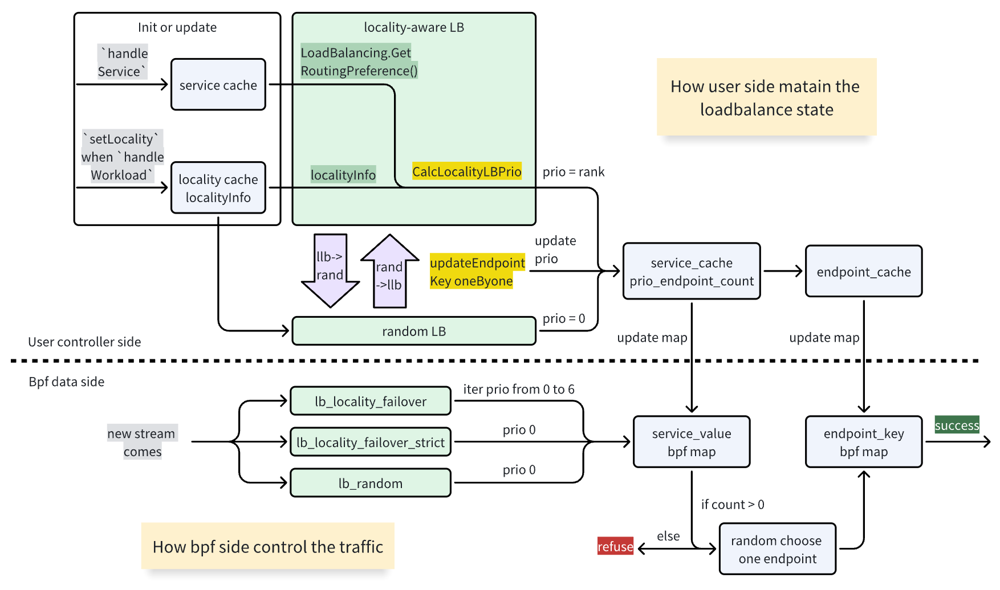

## Locality Load Balancing for Kmesh

### Summary

Add Locality Load Balancing to Kmesh workload mode.

### Motivation

Currently, Kmesh does not support locality aware load balancing. Locality Load Balancing optimizes performance and reliability in distributed systems by directing traffic to the nearest service instances. This approach reduces latency, enhances availability, and lowers costs associated with cross-region data transfers. It also ensures compliance with data sovereignty regulations and improves the overall user experience by providing faster and more reliable service responses.

### Goals

The purpose of this proposal is to add locality aware load balancing capabilities to kmesh workload mode, corresponding to locality load balancing in Ztunnel.

### Proposal

Locality load balancing mode: locality failover, locality strict.

What is locality failover mode? When a request accesses the service, the control plane will perform a tiered match between the locality information of the originating pod of the flow and the localities of all healthy backends behind the service. Pods with a higher degree of match indicate that they are geographically closer, and traffic will be preferentially routed to pods with a higher matching pair.

What is locality strict mode? In locality strict mode, the LB (load balancing) algorithm will only select backends that exactly match the routingPreference. This means that in such a mode, the load balancer enforces a strict policy where it only routes traffic to backends based on a perfect match with the specified locality preferences, ensuring that requests are handled by servers that meet specific criteria related to their location or other attributes.

### Design Details

1. New load balancing processing logic in `service_manager` implemented on the BPF side: `lb_locality_failover_handle`.
2. Added more necessary information to the data structure on the BPF side: The map `service_value` stores the load balancing policy `lb_policy` and an array `prio_endpoint_count[PRIO_COUNT]` for counting endpoints of different priorities. The map `endpoint_key` stores the priority `prio` of the current endpoint.
3. Added a `locality_cache` module on the user side to store locality aware information and priority calculation logic.
4. Updated `ServiceValue` and `EndpointKey` map on the user side.
5. We dynamically maintain endpoints corresponding to different priorities by updating the `EndpointKey`. To update the `EndpointKey` when updating the policy, we added an `endpoint_cache` to store additional endpoint information.
6. In the `workload_processor`, we updated the logic for adding and removing endpoints and services, as well as the logic for updating corresponding map information when processing workload and service xDs information. We implemented the LB update logic in `handleWorkloadUnboundServices`. To ensure service continuity, we considered scenarios during policy switching and implemented one-by-one `endpointKey` updates.
7. For the random policy, all endpoints are marked with a priority of 0. For failover or strict policy, the priority is set to 0 for the endpoint with the highest match according to the `routingPreference`.

#### control flow


#### data struct
1. workload.h
```
typedef struct {
    __u32 prio_endpoint_count[PRIO_COUNT]; // endpoint count of current service with prio
    __u32 lb_policy; // load balancing algorithm, currently supports random algorithm, locality loadbalance
                     // Failover/strict mode
    __u32 service_port[MAX_PORT_COUNT]; // service_port[i] and target_port[i] are a pair, i starts from 0 and max value
                                        // is MAX_PORT_COUNT-1
    __u32 target_port[MAX_PORT_COUNT];
    struct ip_addr wp_addr;
    __u32 waypoint_port;
} service_value;

// endpoint map
typedef struct {
    __u32 service_id;    // service id
    __u32 prio;          // 0 means heightest prio, match all scope, 6 means lowest prio.
    __u32 backend_index; // if endpoint_count = 3, then backend_index = 0/1/2
} endpoint_key;
```

2. workload_common.h
```
// loadbalance type
typedef enum {
    LB_POLICY_RANDOM = 0,
    LB_POLICY_STRICT = 1,
    LB_POLICY_FAILOVER = 2,
} lb_policy_t;
```

3. endpoint.go
```
const (
	PrioCount = 7
)

type EndpointKey struct {
	ServiceId    uint32 // service id
	Prio         uint32
	BackendIndex uint32 // if endpoint_count = 3, then backend_index = 1/2/3
}
```

4. locality_cache.go
```
// localityInfo records local node workload locality info
type localityInfo struct {
	region    string // init from workload.GetLocality().GetRegion()
	zone      string // init from workload.GetLocality().GetZone()
	subZone   string // init from workload.GetLocality().GetSubZone()
	nodeName  string // init from os.Getenv("NODE_NAME"), workload.GetNode()
	clusterId string // init from workload.GetClusterId()
	network   string // workload.GetNetwork()
}

type LocalityCache struct {
	mutex        sync.RWMutex
	LocalityInfo *localityInfo
}
```

5. service.go
```
type ServiceValue struct {
	EndpointCount [PrioCount]uint32 // endpoint count of current service
	LbPolicy      uint32            // load balancing algorithm, currently only supports random algorithm
	ServicePort   ServicePorts      // ServicePort[i] and TargetPort[i] are a pair, i starts from 0 and max value is MaxPortNum-1
	TargetPort    TargetPorts
	WaypointAddr  [16]byte
	WaypointPort  uint32
}
```

6. endpoint_cache.go
```
type Endpoint struct {
	ServiceId    uint32
	Prio         uint32
	BackendIndex uint32
}

type EndpointCache interface {
	List(uint32) map[uint32]Endpoint // Endpoint slice by ServiceId
	AddEndpointToService(Endpoint, uint32)
	DeleteEndpoint(Endpoint, uint32)
	DeleteEndpointByServiceId(uint32)
}
```